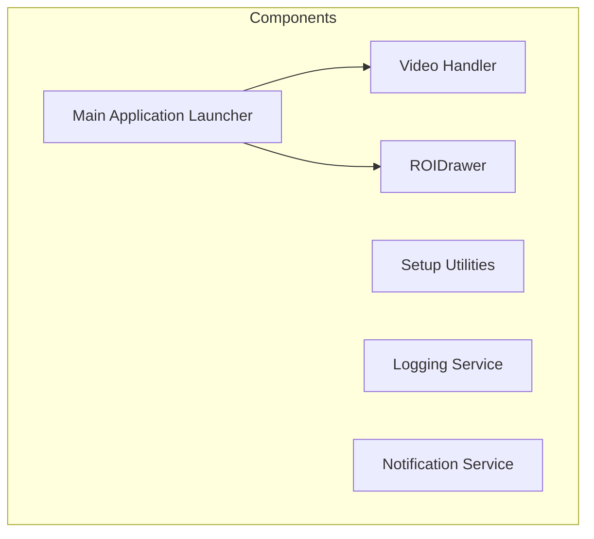
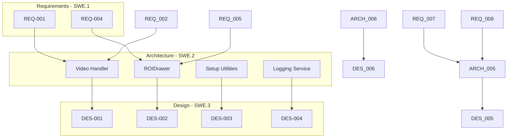
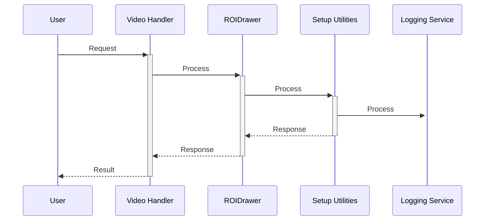

# Architectural Design Document
## Traffic Monitoring System

*Auto-generated by Compliance Coder V-Model Engine*
*Generated: 2026-01-12T10:19:47.822Z*

---

## Overview

The architectural design of the Traffic Monitoring System is structured to facilitate real-time vehicle detection and classification through a modular approach. Each component is designed to handle specific responsibilities, ensuring separation of concerns and enhancing maintainability. The system employs a combination of services, handlers, and utilities to process video feeds, manage Regions of Interest (ROIs), log events, and deliver notifications to users. Interfaces between components are clearly defined to promote interaction and data flow, adhering to the principles of the Model-View-Controller (MVC) pattern and service-oriented architecture.

**Traceability:** ARCH traces UP to REQ and DOWN to DESIGN

## Architectural Patterns

- Model-View-Controller (MVC)
- Service-Oriented Architecture (SOA)

## Component Diagram

## V-Model Traceability

## Components

### ARCH-001: Video Handler

**Type:** handler

**Responsibility:**
Manages video input and processing for the traffic monitoring system.

**Traceability (SWE.2):**
- Requirements (↑): REQ-001, REQ-002, REQ-010
- Designs (↓): DES-001
- Depends On: None
- Verified by (Integration Tests): INT-TEST-001

---

### ARCH-002: ROIDrawer

**Type:** service

**Responsibility:**
Responsible for drawing and managing Regions of Interest (ROI) for detected objects.

**Traceability (SWE.2):**
- Requirements (↑): REQ-004, REQ-005, REQ-006
- Designs (↓): DES-002
- Depends On: None
- Verified by (Integration Tests): INT-TEST-002

---

### ARCH-003: Setup Utilities

**Type:** utility

**Responsibility:**
Contains utility functions for setting up the environment, including downloading models.

**Traceability (SWE.2):**
- Requirements (↑): Derived from system analysis
- Designs (↓): DES-003
- Depends On: None
- Verified by (Integration Tests): INT-TEST-003

---

### ARCH-004: Logging Service

**Type:** service

**Responsibility:**
Handles logging of traffic classes and timestamps for detected events.

**Traceability (SWE.2):**
- Requirements (↑): Derived from system analysis
- Designs (↓): DES-004
- Depends On: None
- Verified by (Integration Tests): INT-TEST-004

---

### ARCH-005: Notification Service

**Type:** service

**Responsibility:**
Delivers real-time notifications to users based on detection results.

**Traceability (SWE.2):**
- Requirements (↑): REQ-007, REQ-008, REQ-009
- Designs (↓): DES-005
- Depends On: None
- Verified by (Integration Tests): INT-TEST-005

---

### ARCH-006: Main Application Launcher

**Type:** controller

**Responsibility:**
Entry point for launching the traffic monitoring application.

**Traceability (SWE.2):**
- Requirements (↑): Derived from system analysis
- Designs (↓): DES-006
- Depends On: ARCH-001, ARCH-002
- Verified by (Integration Tests): INT-TEST-001

---

## Interfaces

### INT-001: draw

Interface for drawing visual elements on the video feed.

**Methods:**
- `drawROI()`
- `updateVisuals()`

**Used By:** ARCH-001, ARCH-002

---

### INT-002: open_browser

Interface for opening a web browser for user interaction.

**Methods:**
- `launchBrowser()`

**Used By:** ARCH-003

---

### INT-003: main

Interface for starting the main application logic.

**Methods:**
- `startApplication()`

**Used By:** ARCH-006

---

## Interface Sequence Diagram

