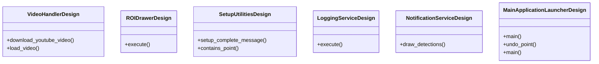
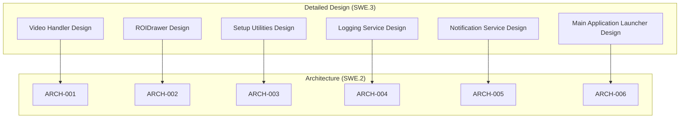
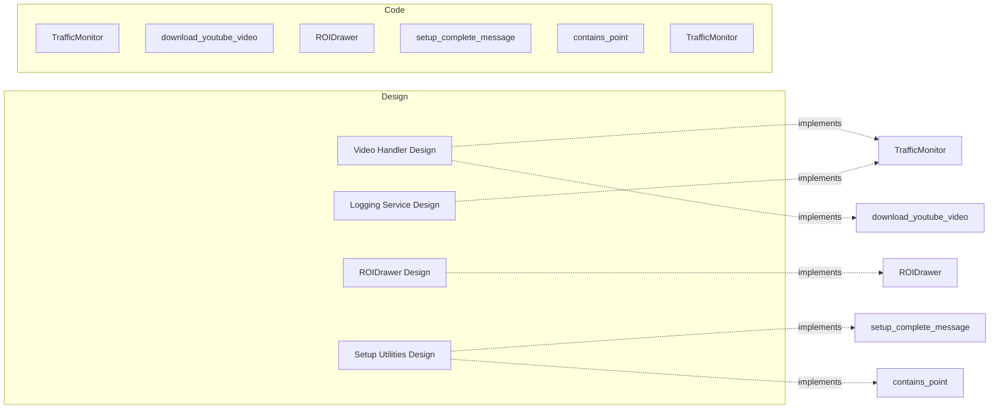

# Detailed Design Document
## Traffic Monitoring System

*Auto-generated by Compliance Coder V-Model Engine*
*Generated: 2026-01-12T10:19:47.823Z*

---

## Overview

This document specifies the detailed design (SWE.3) for Traffic Monitoring System.
Each design spec bridges architecture components to actual code implementation.

**Traceability:** DESIGN traces UP to ARCH and DOWN to CODE

## Class Diagram

## Design-to-Architecture Traceability

## Design-to-Code Mapping

## Design Specifications

### DES-001: Video Handler Design

**Description:**
Detailed design for Video Handler. Implements Manages video input and processing for the traffic monitoring system.

**Classes:** TrafficMonitor

**Functions:** download_youtube_video, load_video

**Traceability (SWE.3):**
- Architecture Component (↑): ARCH-001
- Code Elements (↓): TrafficMonitor, download_youtube_video, load_video
- Verified by (Unit Tests): UNIT-TEST-001

---

### DES-002: ROIDrawer Design

**Description:**
Detailed design for ROIDrawer. Implements Responsible for drawing and managing Regions of Interest (ROI) for detected objects.

**Classes:** ROIDrawer

**Functions:** None

**Traceability (SWE.3):**
- Architecture Component (↑): ARCH-002
- Code Elements (↓): ROIDrawer
- Verified by (Unit Tests): UNIT-TEST-002

---

### DES-003: Setup Utilities Design

**Description:**
Detailed design for Setup Utilities. Implements Contains utility functions for setting up the environment, including downloading models.

**Classes:** None

**Functions:** setup_complete_message, contains_point

**Traceability (SWE.3):**
- Architecture Component (↑): ARCH-003
- Code Elements (↓): setup_complete_message, contains_point
- Verified by (Unit Tests): UNIT-TEST-003

---

### DES-004: Logging Service Design

**Description:**
Detailed design for Logging Service. Implements Handles logging of traffic classes and timestamps for detected events.

**Classes:** TrafficMonitor

**Functions:** None

**Traceability (SWE.3):**
- Architecture Component (↑): ARCH-004
- Code Elements (↓): TrafficMonitor
- Verified by (Unit Tests): UNIT-TEST-004

---

### DES-005: Notification Service Design

**Description:**
Detailed design for Notification Service. Implements Delivers real-time notifications to users based on detection results.

**Classes:** None

**Functions:** draw_detections

**Traceability (SWE.3):**
- Architecture Component (↑): ARCH-005
- Code Elements (↓): draw_detections
- Verified by (Unit Tests): UNIT-TEST-005

---

### DES-006: Main Application Launcher Design

**Description:**
Detailed design for Main Application Launcher. Implements Entry point for launching the traffic monitoring application.

**Classes:** TrafficMonitor

**Functions:** main, undo_point, main, main, contains_point, main

**Traceability (SWE.3):**
- Architecture Component (↑): ARCH-006
- Code Elements (↓): TrafficMonitor, main, undo_point, contains_point
- Verified by (Unit Tests): UNIT-TEST-006

---

## Design-to-Code Matrix

| Design | Architecture | Code Elements | Unit Tests |
|--------|--------------|---------------|------------|
| DES-001 | ARCH-001 | TrafficMonitor, download_youtube_video | UNIT-TEST-001 |
| DES-002 | ARCH-002 | ROIDrawer | UNIT-TEST-002 |
| DES-003 | ARCH-003 | setup_complete_message, contains_point | UNIT-TEST-003 |
| DES-004 | ARCH-004 | TrafficMonitor | UNIT-TEST-004 |
| DES-005 | ARCH-005 | draw_detections | UNIT-TEST-005 |
| DES-006 | ARCH-006 | TrafficMonitor, main | UNIT-TEST-006 |
