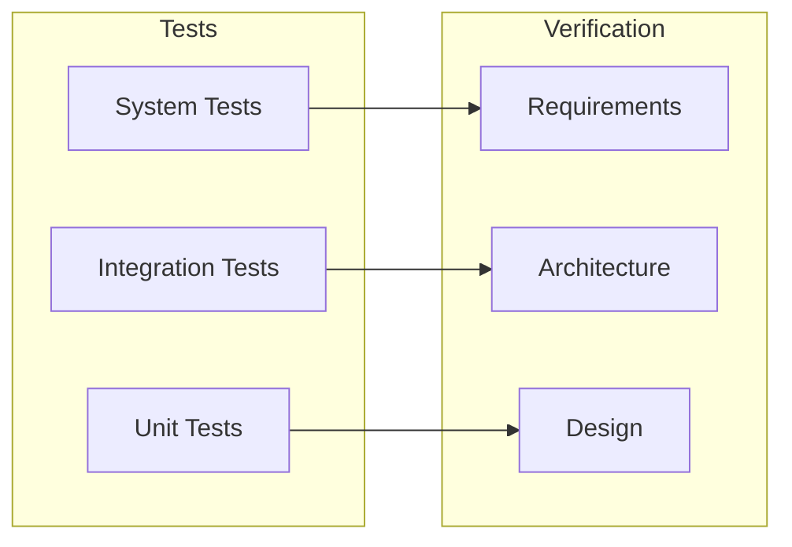

# Test Specification Document
## Traffic Monitoring System

*Auto-generated by Compliance Coder V-Model Engine*
*Generated: 2026-01-12T10:19:47.824Z*

---

## Overview

This document specifies tests at all V-Model levels:
- **System Tests (SWE.6):** Verify requirements
- **Integration Tests (SWE.5):** Verify architecture integration
- **Unit Tests (SWE.4):** Verify code implementation

## V-Model Test Coverage

## Test Hierarchy

```mermaid
flowchart TD
    subgraph SWE6["System Tests (SWE.6)"]
        SYS_TEST_001["Real-Time Vehicle Detection Accuracy Test"]
        SYS_TEST_002["Real-Time Processing Latency Test"]
        SYS_TEST_003["Verify Vehicle Detection Result Output"]
    end
    subgraph SWE5["Integration Tests (SWE.5)"]
        INT_TEST_001["Integration Test: Main Application Launcher"]
        INT_TEST_002["Integration Test: Video Handler"]
        INT_TEST_003["Integration Test: ROIDrawer"]
    end
    subgraph SWE4["Unit Tests (SWE.4)"]
        UNIT_TEST_001["Unit Tests: Video Handler Design"]
        UNIT_TEST_002["Unit Tests: ROIDrawer Design"]
        UNIT_TEST_003["Unit Tests: Setup Utilities Design"]
    end
    SYS_TEST_001 -.->|verifies| REQ_001[REQ-001]
    SYS_TEST_002 -.->|verifies| REQ_002[REQ-002]
    SYS_TEST_003 -.->|verifies| REQ_003[REQ-003]
    INT_TEST_001 -.->|verifies| ARCH_006[ARCH-006]
    INT_TEST_002 -.->|verifies| ARCH_001[ARCH-001]
    INT_TEST_003 -.->|verifies| ARCH_002[ARCH-002]
    UNIT_TEST_001 -.->|verifies| DES_001[DES-001]
    UNIT_TEST_002 -.->|verifies| DES_002[DES-002]
    UNIT_TEST_003 -.->|verifies| DES_003[DES-003]
```

## System Tests

### SYS-TEST-001: Real-Time Vehicle Detection Accuracy Test

This test verifies that the vehicle detection system meets the requirement of detecting and classifying vehicles with an accuracy of at least 95% using a standard dataset.

**Verifies:** REQ-001

**Test Cases:**

#### SYS-TC-1-1: Vehicle Detection Accuracy Measurement

**Preconditions:**
- The vehicle detection system is installed and configured.
- A standard dataset containing at least 1000 video frames with labeled vehicles is available.

**Steps:**
1. Load the standard dataset into the vehicle detection system.
2. Run the vehicle detection algorithm on the dataset.
3. Collect the detection results including true positives, false positives, and false negatives.
4. Calculate precision and recall based on the detection results.
5. Generate a report of detection accuracy metrics.

**Expected Result:**
The system reports a precision and recall of at least 95%, confirming that the vehicle detection accuracy requirement is satisfied.

---

### SYS-TEST-002: Real-Time Processing Latency Test

This test verifies that the system processes video frames and provides vehicle detection results within the specified latency of 200 milliseconds.

**Verifies:** REQ-002

**Test Cases:**

#### SYS-TC-2-1: Average Processing Time Test

**Preconditions:**
- The system is set up with a video input source that simulates real-time video feed.
- The logging mechanism for processing times is enabled.

**Steps:**
1. Start the video feed.
2. Capture the processing time for each video frame processed by the system.
3. Allow the system to run for a defined duration (e.g., 10 minutes) to collect sufficient data.
4. Stop the video feed.

**Expected Result:**
The average processing time for the video frames is calculated and verified to be less than or equal to 200 milliseconds. Additionally, 95% of the logged processing times are less than or equal to 200 milliseconds.

---

### SYS-TEST-003: Verify Vehicle Detection Result Output

This test verifies that the system outputs vehicle detection results in the required structured format, including bounding boxes, class labels, and confidence scores, while adhering to the specified latency.

**Verifies:** REQ-003

**Test Cases:**

#### SYS-TC-3-1: Verify Output Format and Content

**Preconditions:**
- The vehicle detection system is deployed and operational.
- Test video frames containing various vehicles (cars, trucks, etc.) are available.

**Steps:**
1. Process a set of test video frames through the vehicle detection system.
2. Capture the output results for each processed frame.

**Expected Result:**
The output for each frame contains an array of objects, each with bounding box coordinates (x, y, width, height), a class label (e.g., car, truck), and a confidence score (0-1).

#### SYS-TC-3-2: Verify Latency of Detection Results

**Preconditions:**
- The vehicle detection system is deployed and operational.
- Test video frames containing various vehicles (cars, trucks, etc.) are available.

**Steps:**
1. Start a timer before processing a set of test video frames.
2. Process the frames through the vehicle detection system.
3. Stop the timer after receiving the output results for all frames.

**Expected Result:**
The total processing time for all frames is within the specified latency limit, and the output results are consistent and correctly formatted.

---

### SYS-TEST-004: Verify ROI Visualization for Detected Vehicles

This test verifies that the system correctly visualizes Regions of Interest (ROIs) for detected vehicles on the user interface according to the specified requirements.

**Verifies:** REQ-004

**Test Cases:**

#### SYS-TC-4-1: Test ROI Overlay Display

**Preconditions:**
- The system is powered on and fully operational.
- The video feed is being captured and displayed at a minimum resolution of 1080p.
- Vehicles are present in the video feed for detection.

**Steps:**
1. Initiate the vehicle detection process.
2. Observe the video feed for the appearance of ROIs overlaid on detected vehicles.

**Expected Result:**
ROIs are displayed as distinct overlays on the video feed, clearly indicating the detected vehicles.

#### SYS-TC-4-2: Test Real-Time ROI Update

**Preconditions:**
- The system is powered on and fully operational.
- The video feed is being captured and displayed at a minimum resolution of 1080p.
- Vehicles are present in the video feed for detection.

**Steps:**
1. Initiate the vehicle detection process.
2. Introduce a new vehicle into the video feed after the initial detection.
3. Measure the time taken for the new ROI to appear on the video feed.

**Expected Result:**
The new ROI is displayed within 200 milliseconds of the vehicle entering the video feed.

---

### SYS-TEST-005: ROI Management Functionality Test

This test verifies that the system allows users to create, modify, and delete Regions of Interest (ROIs) for detected vehicles as specified in REQ-005.

**Verifies:** REQ-005

**Test Cases:**

#### SYS-TC-5-1: Create ROI Test

**Preconditions:**
- User is logged into the system
- Video feed is active

**Steps:**
1. User selects a region on the video feed to create a new ROI.
2. User confirms the selection.
3. Observe the visual indication confirming the creation of the ROI.

**Expected Result:**
A new ROI is created, and a visual indication is displayed on the video feed.

#### SYS-TC-5-2: Modify ROI Test

**Preconditions:**
- User is logged into the system
- At least one ROI exists on the video feed

**Steps:**
1. User selects an existing ROI.
2. User drags the borders of the ROI to modify its size.
3. Observe the changes reflected immediately on the interface.

**Expected Result:**
The ROI is modified, and the changes are reflected in real-time on the interface.

#### SYS-TC-5-3: Delete ROI Test

**Preconditions:**
- User is logged into the system
- At least one ROI exists on the video feed

**Steps:**
1. User selects an existing ROI to delete.
2. User confirms the deletion when prompted.
3. Observe that the ROI is removed from the video feed.

**Expected Result:**
The ROI is deleted after user confirmation, and it no longer appears on the video feed.

---

### SYS-TEST-006: Verify ROI Data Export Functionality

This test verifies that the system allows users to export ROI data in CSV format and that the export functionality is accessible within 3 clicks from the main interface.

**Verifies:** REQ-006

**Test Cases:**

#### SYS-TC-6-1: Export ROI Data to CSV

**Preconditions:**
- User is logged into the system.
- ROI data is available in the system.

**Steps:**
1. Navigate to the main interface.
2. Click on the 'Data Export' option.
3. Select 'Export ROI Data' from the dropdown menu.
4. Choose CSV format for export.
5. Click on the 'Export' button.

**Expected Result:**
A CSV file containing the ROI data, including coordinates and timestamps, is downloaded successfully.

#### SYS-TC-6-2: Accessibility of Export Functionality

**Preconditions:**
- User is logged into the system.

**Steps:**
1. Navigate to the main interface.
2. Click on the 'Data Export' option.
3. Select 'Export ROI Data' from the dropdown menu.

**Expected Result:**
The 'Export ROI Data' option is accessible within 3 clicks from the main interface.

---

### SYS-TEST-007: Test Real-Time Notification Triggering for Traffic Events

This test verifies that the system sends real-time notifications to users within 5 seconds of detecting a traffic event, including the type and location of the event.

**Verifies:** REQ-007

**Test Cases:**

#### SYS-TC-7-1: Verify Notification Sent Within 5 Seconds of Traffic Event Detection

**Preconditions:**
- User is registered and has enabled notifications.
- The system is operational and monitoring traffic events.

**Steps:**
1. Simulate a traffic event detection in the system (e.g., accident, congestion).
2. Start a timer immediately after the traffic event is detected.
3. Monitor the user's device for the incoming notification.
4. Stop the timer once the notification is received.

**Expected Result:**
The notification is received within 5 seconds, containing the correct type of traffic event and the location of the event.

---

### SYS-TEST-008: User Notification Preferences Configuration Test

This test verifies that users can configure their notification preferences for traffic events and that these preferences are saved and applied correctly.

**Verifies:** REQ-008

**Test Cases:**

#### SYS-TC-8-1: Enable and Save Notification Preferences for Traffic Events

**Preconditions:**
- User is logged into the system
- User has access to the notification preferences settings

**Steps:**
1. Navigate to the notification preferences settings page
2. Enable notifications for 'Accidents' traffic events
3. Disable notifications for 'Road Closures' traffic events
4. Click on the 'Save Preferences' button
5. Log out of the system
6. Log back into the system
7. Navigate back to the notification preferences settings page

**Expected Result:**
The system should show 'Accidents' notifications enabled and 'Road Closures' notifications disabled in the user preferences.

#### SYS-TC-8-2: Apply Saved Notification Preferences

**Preconditions:**
- User has previously saved notification preferences

**Steps:**
1. Trigger a traffic event of type 'Accidents'
2. Check if the user receives a notification for the 'Accidents' event
3. Trigger a traffic event of type 'Road Closures'
4. Check if the user receives a notification for the 'Road Closures' event

**Expected Result:**
The user should receive a notification for the 'Accidents' event but not for the 'Road Closures' event.

---

### SYS-TEST-009: Verify Notification Delivery Method

This test verifies that the system delivers notifications to users via their preferred communication channel (push notifications or email) within the specified time frame.

**Verifies:** REQ-009

**Test Cases:**

#### SYS-TC-9-1: Test Push Notification Delivery

**Preconditions:**
- User has opted for push notifications as their preferred delivery method.
- An event that triggers a notification occurs.

**Steps:**
1. Trigger the event that generates a notification.
2. Measure the time taken for the push notification to be delivered to the user's device.

**Expected Result:**
The push notification is received within 5 seconds of the event detection.

#### SYS-TC-9-2: Test Email Notification Delivery

**Preconditions:**
- User has opted for email as their preferred delivery method.
- An event that triggers a notification occurs.

**Steps:**
1. Trigger the event that generates a notification.
2. Measure the time taken for the email notification to be delivered to the user's email inbox.

**Expected Result:**
The email notification is received within 5 seconds of the event detection.

---

### SYS-TEST-010: System Test: Video Feed Format Support

Verify system satisfies Video Feed Format Support

**Verifies:** REQ-010

**Test Cases:**

#### STC-010-01: Verify: The system shall successfully process video feeds ...

**Preconditions:**
- System deployed and accessible

**Steps:**
1. Prepare test environment
2. Execute test scenario
3. Observe system behavior

**Expected Result:**
The system shall successfully process video feeds in H.264 format without loss of data.

#### STC-010-02: Verify: The system shall successfully process video feeds ...

**Preconditions:**
- System deployed and accessible

**Steps:**
1. Prepare test environment
2. Execute test scenario
3. Observe system behavior

**Expected Result:**
The system shall successfully process video feeds in MPEG-4 format without loss of data.

#### STC-010-03: Verify: The system shall successfully process video feeds ...

**Preconditions:**
- System deployed and accessible

**Steps:**
1. Prepare test environment
2. Execute test scenario
3. Observe system behavior

**Expected Result:**
The system shall successfully process video feeds in MJPEG format without loss of data.

---

### SYS-TEST-011: System Test: Video Input Latency

Verify system satisfies Video Input Latency

**Verifies:** REQ-011

**Test Cases:**

#### STC-011-01: Verify: The system shall measure and log the latency for e...

**Preconditions:**
- System deployed and accessible

**Steps:**
1. Prepare test environment
2. Execute test scenario
3. Observe system behavior

**Expected Result:**
The system shall measure and log the latency for each video input feed.

#### STC-011-02: Verify: The system shall trigger an alert if the latency e...

**Preconditions:**
- System deployed and accessible

**Steps:**
1. Prepare test environment
2. Execute test scenario
3. Observe system behavior

**Expected Result:**
The system shall trigger an alert if the latency exceeds 200 milliseconds for any video input.

---

### SYS-TEST-012: System Test: Error Handling for Video Input

Verify system satisfies Error Handling for Video Input

**Verifies:** REQ-012

**Test Cases:**

#### STC-012-01: Verify: The system shall log an error message when a video...

**Preconditions:**
- System deployed and accessible

**Steps:**
1. Prepare test environment
2. Execute test scenario
3. Observe system behavior

**Expected Result:**
The system shall log an error message when a video feed fails to initialize.

#### STC-012-02: Verify: The system shall log an error message when a video...

**Preconditions:**
- System deployed and accessible

**Steps:**
1. Prepare test environment
2. Execute test scenario
3. Observe system behavior

**Expected Result:**
The system shall log an error message when a video feed is interrupted or lost.

#### STC-012-03: Verify: The system shall provide a recovery mechanism to a...

**Preconditions:**
- System deployed and accessible

**Steps:**
1. Prepare test environment
2. Execute test scenario
3. Observe system behavior

**Expected Result:**
The system shall provide a recovery mechanism to attempt re-establishing the video feed within 5 seconds of detection.

---

### SYS-TEST-013: System Test: Environment Setup Utility

Verify system satisfies Environment Setup Utility

**Verifies:** REQ-013

**Test Cases:**

#### STC-013-01: Verify: The utility shall accept a configuration file as i...

**Preconditions:**
- System deployed and accessible

**Steps:**
1. Prepare test environment
2. Execute test scenario
3. Observe system behavior

**Expected Result:**
The utility shall accept a configuration file as input and apply the settings within 5 seconds.

#### STC-013-02: Verify: The utility shall log the configuration process an...

**Preconditions:**
- System deployed and accessible

**Steps:**
1. Prepare test environment
2. Execute test scenario
3. Observe system behavior

**Expected Result:**
The utility shall log the configuration process and report any errors encountered during setup.

---

### SYS-TEST-014: System Test: Model Download Functionality

Verify system satisfies Model Download Functionality

**Verifies:** REQ-014

**Test Cases:**

#### STC-014-01: Verify: The download function shall successfully retrieve ...

**Preconditions:**
- System deployed and accessible

**Steps:**
1. Prepare test environment
2. Execute test scenario
3. Observe system behavior

**Expected Result:**
The download function shall successfully retrieve models and store them in the designated local directory within 10 seconds.

#### STC-014-02: Verify: The function shall verify the integrity of the dow...

**Preconditions:**
- System deployed and accessible

**Steps:**
1. Prepare test environment
2. Execute test scenario
3. Observe system behavior

**Expected Result:**
The function shall verify the integrity of the downloaded models by checking their checksums against the repository.

---

### SYS-TEST-015: System Test: User Feedback Mechanism

Verify system satisfies User Feedback Mechanism

**Verifies:** REQ-015

**Test Cases:**

#### STC-015-01: Verify: The system shall display progress messages during ...

**Preconditions:**
- System deployed and accessible

**Steps:**
1. Prepare test environment
2. Execute test scenario
3. Observe system behavior

**Expected Result:**
The system shall display progress messages during the setup and model download processes.

#### STC-015-02: Verify: The system shall provide a summary report upon com...

**Preconditions:**
- System deployed and accessible

**Steps:**
1. Prepare test environment
2. Execute test scenario
3. Observe system behavior

**Expected Result:**
The system shall provide a summary report upon completion, indicating success or failure of each step.

---

### SYS-TEST-016: System Test: Log Traffic Event Data

Verify system satisfies Log Traffic Event Data

**Verifies:** REQ-016

**Test Cases:**

#### STC-016-01: Verify: The system shall log at least 95% of detected traf...

**Preconditions:**
- System deployed and accessible

**Steps:**
1. Prepare test environment
2. Execute test scenario
3. Observe system behavior

**Expected Result:**
The system shall log at least 95% of detected traffic events within 1 second of detection.

#### STC-016-02: Verify: Each log entry shall include the traffic class, ti...

**Preconditions:**
- System deployed and accessible

**Steps:**
1. Prepare test environment
2. Execute test scenario
3. Observe system behavior

**Expected Result:**
Each log entry shall include the traffic class, timestamp, and a unique event identifier.

---

### SYS-TEST-017: System Test: Access Traffic Event Logs

Verify system satisfies Access Traffic Event Logs

**Verifies:** REQ-017

**Test Cases:**

#### STC-017-01: Verify: The system shall allow traffic analysts to retriev...

**Preconditions:**
- System deployed and accessible

**Steps:**
1. Prepare test environment
2. Execute test scenario
3. Observe system behavior

**Expected Result:**
The system shall allow traffic analysts to retrieve logs for a specified date range.

#### STC-017-02: Verify: The system shall return logs in a structured forma...

**Preconditions:**
- System deployed and accessible

**Steps:**
1. Prepare test environment
2. Execute test scenario
3. Observe system behavior

**Expected Result:**
The system shall return logs in a structured format (e.g., JSON or CSV) within 2 seconds of a request.

---

### SYS-TEST-018: System Test: Log Storage and Retention

Verify system satisfies Log Storage and Retention

**Verifies:** REQ-018

**Test Cases:**

#### STC-018-01: Verify: The system shall ensure that logs are not deleted ...

**Preconditions:**
- System deployed and accessible

**Steps:**
1. Prepare test environment
2. Execute test scenario
3. Observe system behavior

**Expected Result:**
The system shall ensure that logs are not deleted or overwritten for at least 30 days after creation.

#### STC-018-02: Verify: The system shall provide a mechanism to archive lo...

**Preconditions:**
- System deployed and accessible

**Steps:**
1. Prepare test environment
2. Execute test scenario
3. Observe system behavior

**Expected Result:**
The system shall provide a mechanism to archive logs older than 30 days without data loss.

---

## Integration Tests

### INT-TEST-001: Integration Test: Main Application Launcher

Verify Main Application Launcher integrates correctly with its dependencies

**Verifies:** ARCH-006

**Test Cases:**

- **Main Application Launcher dependency integration:** Component integrates successfully with all dependencies

---

### INT-TEST-002: Integration Test: Video Handler

Verify Video Handler integrates correctly with dependent components

**Verifies:** ARCH-001

**Test Cases:**

- **Verify Video Handler component integration:** Components communicate correctly via defined interfaces

---

### INT-TEST-003: Integration Test: ROIDrawer

Verify ROIDrawer integrates correctly with dependent components

**Verifies:** ARCH-002

**Test Cases:**

- **Verify ROIDrawer component integration:** Components communicate correctly via defined interfaces

---

### INT-TEST-004: Integration Test: Setup Utilities

Verify Setup Utilities integrates correctly with dependent components

**Verifies:** ARCH-003

**Test Cases:**

- **Verify Setup Utilities component integration:** Components communicate correctly via defined interfaces

---

### INT-TEST-005: Integration Test: Logging Service

Verify Logging Service integrates correctly with dependent components

**Verifies:** ARCH-004

**Test Cases:**

- **Verify Logging Service component integration:** Components communicate correctly via defined interfaces

---

### INT-TEST-006: Integration Test: Notification Service

Verify Notification Service integrates correctly with dependent components

**Verifies:** ARCH-005

**Test Cases:**

- **Verify Notification Service component integration:** Components communicate correctly via defined interfaces

---

## Unit Tests

### UNIT-TEST-001: Unit Tests: Video Handler Design

Unit tests verifying Video Handler Design

**Verifies:** DES-001

**Test Cases:**
- Test TrafficMonitor
- Test download_youtube_video
- Test load_video

---

### UNIT-TEST-002: Unit Tests: ROIDrawer Design

Unit tests verifying ROIDrawer Design

**Verifies:** DES-002

**Test Cases:**
- Test ROIDrawer

---

### UNIT-TEST-003: Unit Tests: Setup Utilities Design

Unit tests verifying Setup Utilities Design

**Verifies:** DES-003

**Test Cases:**
- Test setup_complete_message
- Test contains_point

---

### UNIT-TEST-004: Unit Tests: Logging Service Design

Unit tests verifying Logging Service Design

**Verifies:** DES-004

**Test Cases:**
- Test TrafficMonitor

---

### UNIT-TEST-005: Unit Tests: Notification Service Design

Unit tests verifying Notification Service Design

**Verifies:** DES-005

**Test Cases:**
- Test draw_detections

---

### UNIT-TEST-006: Unit Tests: Main Application Launcher Design

Unit tests verifying Main Application Launcher Design

**Verifies:** DES-006

**Test Cases:**
- Test TrafficMonitor
- Test main
- Test undo_point
- Test contains_point

---

## Test Coverage Matrix

| Test ID | Level | Verifies | Status |
|---------|-------|----------|--------|
| SYS-TEST-001 | system | REQ-001 | Planned |
| SYS-TEST-002 | system | REQ-002 | Planned |
| SYS-TEST-003 | system | REQ-003 | Planned |
| SYS-TEST-004 | system | REQ-004 | Planned |
| SYS-TEST-005 | system | REQ-005 | Planned |
| SYS-TEST-006 | system | REQ-006 | Planned |
| SYS-TEST-007 | system | REQ-007 | Planned |
| SYS-TEST-008 | system | REQ-008 | Planned |
| SYS-TEST-009 | system | REQ-009 | Planned |
| SYS-TEST-010 | system | REQ-010 | Planned |
| SYS-TEST-011 | system | REQ-011 | Planned |
| SYS-TEST-012 | system | REQ-012 | Planned |
| SYS-TEST-013 | system | REQ-013 | Planned |
| SYS-TEST-014 | system | REQ-014 | Planned |
| SYS-TEST-015 | system | REQ-015 | Planned |
| SYS-TEST-016 | system | REQ-016 | Planned |
| SYS-TEST-017 | system | REQ-017 | Planned |
| SYS-TEST-018 | system | REQ-018 | Planned |
| INT-TEST-001 | integration | ARCH-006 | Planned |
| INT-TEST-002 | integration | ARCH-001 | Planned |
| INT-TEST-003 | integration | ARCH-002 | Planned |
| INT-TEST-004 | integration | ARCH-003 | Planned |
| INT-TEST-005 | integration | ARCH-004 | Planned |
| INT-TEST-006 | integration | ARCH-005 | Planned |
| UNIT-TEST-001 | unit | DES-001 | Planned |
| UNIT-TEST-002 | unit | DES-002 | Planned |
| UNIT-TEST-003 | unit | DES-003 | Planned |
| UNIT-TEST-004 | unit | DES-004 | Planned |
| UNIT-TEST-005 | unit | DES-005 | Planned |
| UNIT-TEST-006 | unit | DES-006 | Planned |
